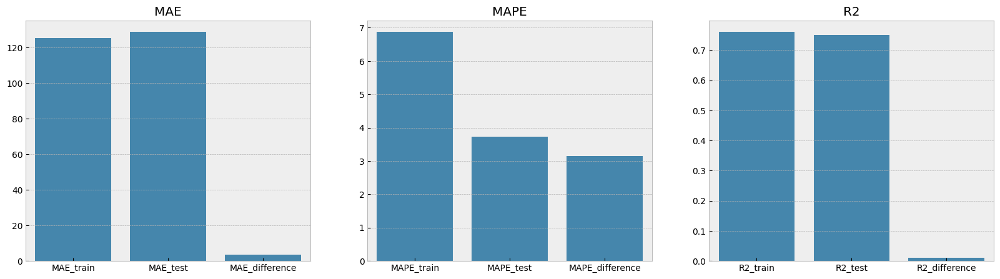

# Модель прогнозирования стоимости жилья для агентства недвижимости

Агентство недвижимости столкнулось с проблемой — риелторы тратят слишком много времени на сортировку объявлений и поиск выгодных предложений. Поэтому скорость их реакции и качество анализа не дотягивают до уровня конкурентов. Это сказывается на финансовых показателях агентства.

**Наша цель** — разработать модель машинного обучения, которая поможет обрабатывать объявления и увеличит число сделок и прибыль агентства.


## Данные
Описание данных следующее:

- `status` — статус продажи;
- `private pool` и `PrivatePool` — наличие собственного бассейна;
- `ropertyType` — тип объекта недвижимости;
- `street` — адрес объекта;
- `baths` — количество ванных комнат;
- `homeFacts` — сведения о строительстве объекта (содержит несколько типов сведений, влияющих на оценку объекта);
- `fireplace` — наличие камина;
- `city` — город;
- `schools` — сведения о школах в районе;
- `sqft` — площадь в футах;
- `zipcode` — почтовый индекс;
- `beds` — количество спален;
- `state` — штат;
- `stories` — количество этажей;
- `mls-id` и `MlsId` — идентификатор MLS (Multiple Listing Service, система мультилистинга);
- `target` — цена объекта недвижимости (целевой признак, который необходимо спрогнозировать).


## Работа
Структура всей работы состоит из нескольких тематических файлов-ноутбуков:

- `data_processing_nb.ipynb` - здесь происходила обработка данных, генерация новых признаков и очистка, пока без разведывательного анализа. Результат работы сохранен в отдельный датасет.

- `modeling_nb.ipynb` - здесь происходит разведывательный анализ данных, статистические исследования, и затем подбор и обучение моделей. Результат сохранен в pickle. 

Также здесь есть файл `functions.py` - библиотека с техническими функциями, которые используются в ноутбуках: 

- `get_data_info()` - выводит на экран основную информацию о датасете: количество пропусков в процентном соотношении, количество уникальных значений и типы данных каждого признака.
- `get_populars()` - выводит на экран (по умолчанию) 100 самых часто встречающихся значений в признаке. 
- `get_sums()` - нужна для бинарных переменных, считает суммы по каждому столбцу, где в названии встречается какое-то слово.
- `get_vc()` - выводит на экран (по умолчанию) 20 самых популярных значений в столбце и количество их в нем.

И папка `app`, в котрой я пытался реализовать модель в продакшн. 

- Папка `data` содержит данные, которые подаются в модель.
- Папка `models` содержит модель, сохраненную в формат pickle.
- Файл `server.py` - это приложение, которое принимает данные и предсказывает (работает на localhost).
- Файл `client.py` - это приложение, котрое отправляет данные на сервер. 


## Итоги 
Мне удалось создать следующую модель регрессии:

```python
LGBMRegressor(
    max_depth=10, 
    n_estimators=300, 
    num_leaves=30,
    n_jobs=-1, 
    random_state=314
) 
```

Она имеет следующие показатели метрик:
